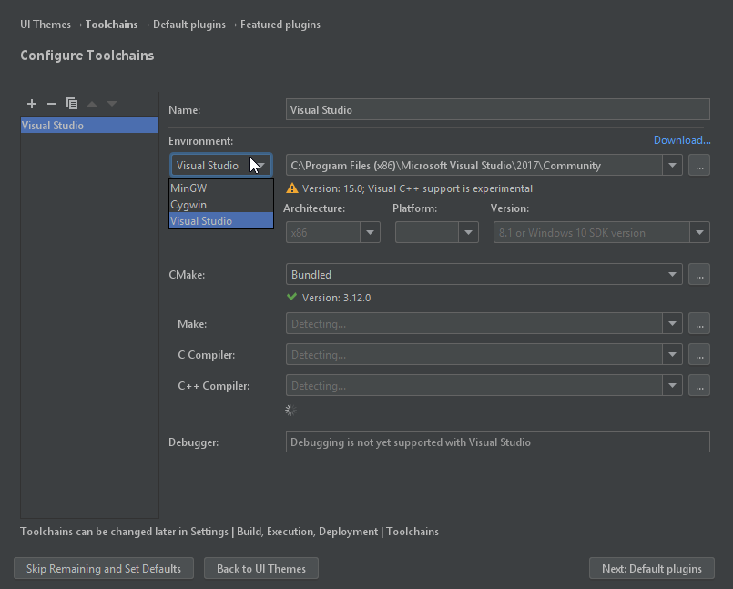
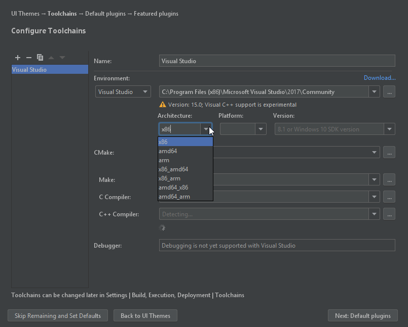
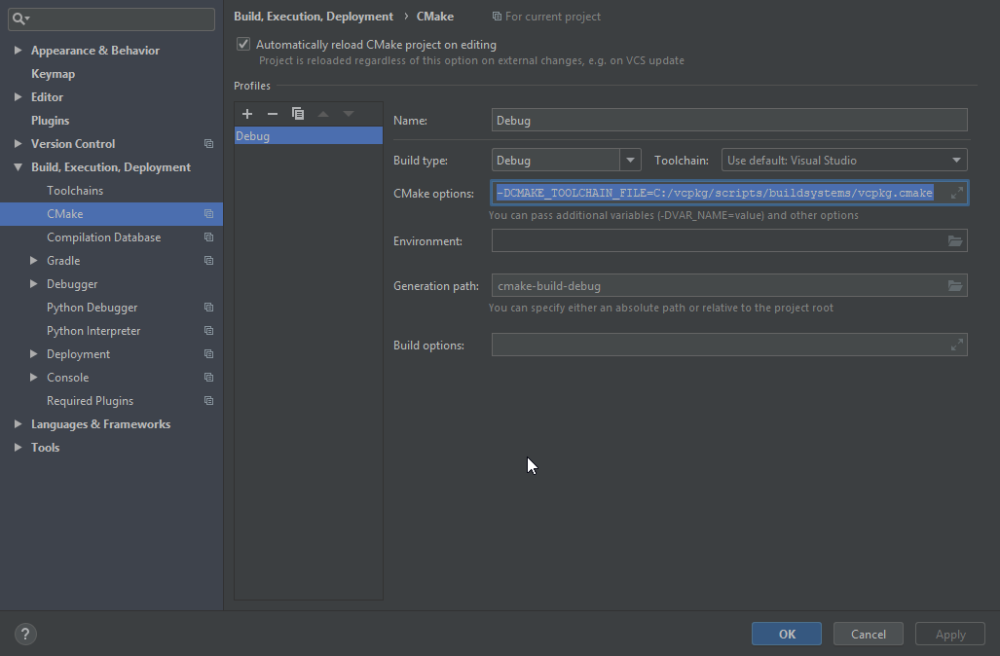

# SDL Setup
SDL Setup is a basic C++ template project to get started with SDL, using CMake and the Clion IDE.

## Getting started
### Prerequisites
```
cmake # install however your platform wants you to
g++/clang++/msvc # toolchain will be explained
sdl2 # library will be explained
```

### Installation
#### Windows
##### Toolchain
Getting started on Windows takes a bit of effort. First off, you will need a proper compiler.
The easiest way to get started, is using Visual Studio (MSVC). Run the VS2017 installer, and install the C++ environment.

##### Package manager
The preferred way to get SDL installed is using a package manager.
Microsoft has recently released [vcpkg](https://github.com/Microsoft/vcpkg), which we will be using for these instructions.
Other options could be [Conan](https://conan.io/), or [Hunter](https://github.com/ruslo/hunter).

1. Install vcpkg in whatever dir you want, recommended in C:\\. PowerShell:

```powershell
PS> git clone https://github.com/Microsoft/vcpkg.git
PS> cd vcpkg
PS> .\bootstrap-vcpkg.bat
```

2. Hook up integration
```powershell
PS> .\vcpkg integrate install
```

3. Install SDL
```powershell
PS> .\vcpkg install sdl2
```

##### Clion

Download [Clion](https://www.jetbrains.com/clion/download/#section=windows) from their website. If you have not already, get a free student license.

Follow the initial setup. When you have to pick a toolchain, follow these steps:

1. Under *Environment*, pick 'Visual Studio'.



2. Under *Architecture*, pick 'x86'.



3. Go to Settings (File -> Settings, or Ctrl+Alt+S). Uncollapse **Build, Execution, Deployment**. Pick *CMake*.
In the CMake options, fill in `-DCMAKE_TOOLCHAIN_FILE={ VPCKG DIR }/scripts/buildsystems/vcpkg.cmake`, or `-DCMAKE_TOOLCHAIN_FILE=C:/vcpkg/scripts/buildsystems/vcpkg.cmake` if you followed the default instructions for vcpkg.



#### Linux
##### Toolchain
Building on Linux is much easier. For this setup, we will be using Ubuntu 18.04/Debian. Install either g++ or clang++ using apt.
`sudo apt-get install clang++ g++`

##### Package manager
Linux does not need a package manager, besides its own. On Ubuntu:
`sudo apt-get install libsdl-2dev`

##### Clion
Clion is optional, use whatever CMake-compatible IDE, or your favorite text editor if you want to. Building can be done
in the terminal.

Clion can be installed using the default settings.

### Compiling and running
#### Windows
1. Git clone the repo.
2. Open Clion, 'Import Project from Sources'. Navigate to the repo.
3. Wait for CMake to finish processing, and try building. Building should be successful.
4. Go to the project folder, it should contain a `/bin` folder.
5. Running the exe will result in an error: you need the appropriate DLL's.
6. Go to `{ VCPKG DIR}/installed/x86-windows/debug/bin`, copy paste SDL2d.dll to the project/bin folder, and rename to SDL2.dll
7. Run the executable again. On success, a blank window called 'An SDL2 Window' will pop up, and dissapear after 3
   seconds.

#### Linux
##### Clion
Follow Windows steps 1-4: you do not need DLL's. It will work out of the box.

#### Terminal

1. Git clone the repo.
2. Create a `build` folder, cd into it.
3. `cmake ..` to generate build files. `make` to compile.
4. Executable can be found in project/bin.
5. Run the executable. On success, a blank window called 'An SDL2 Window' will pop up, and dissapear after 3
   seconds.

